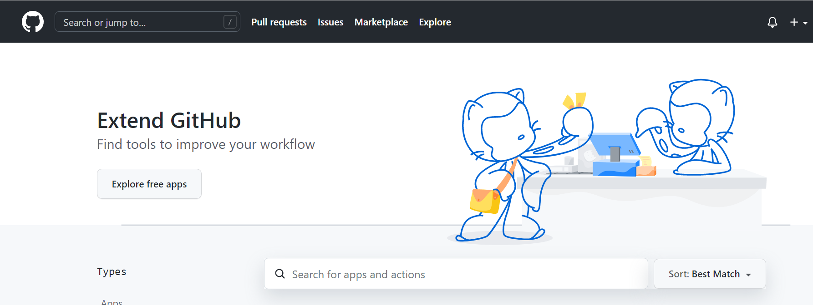
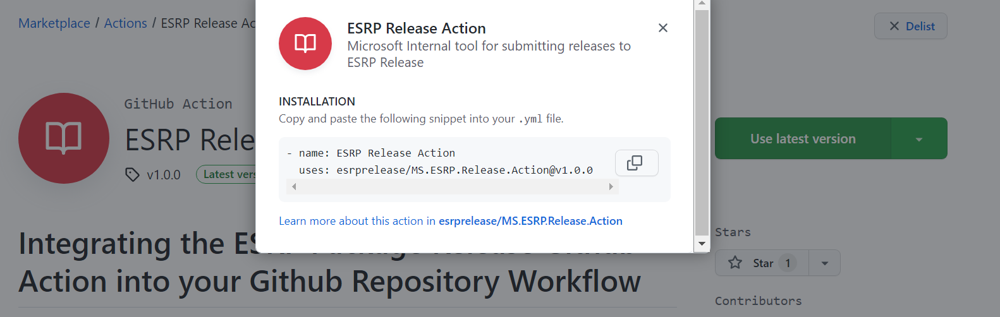
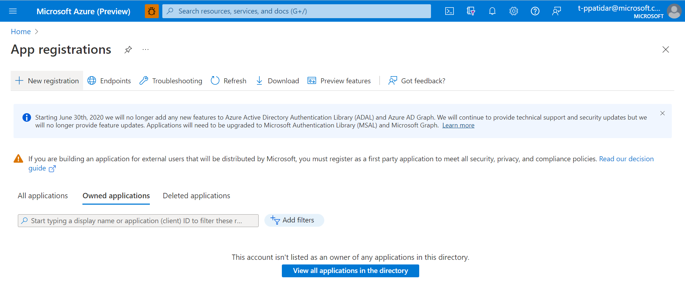
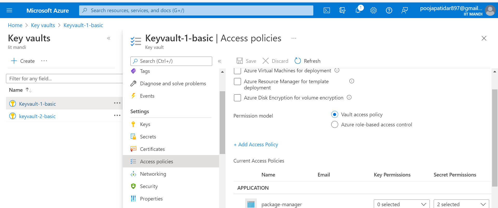
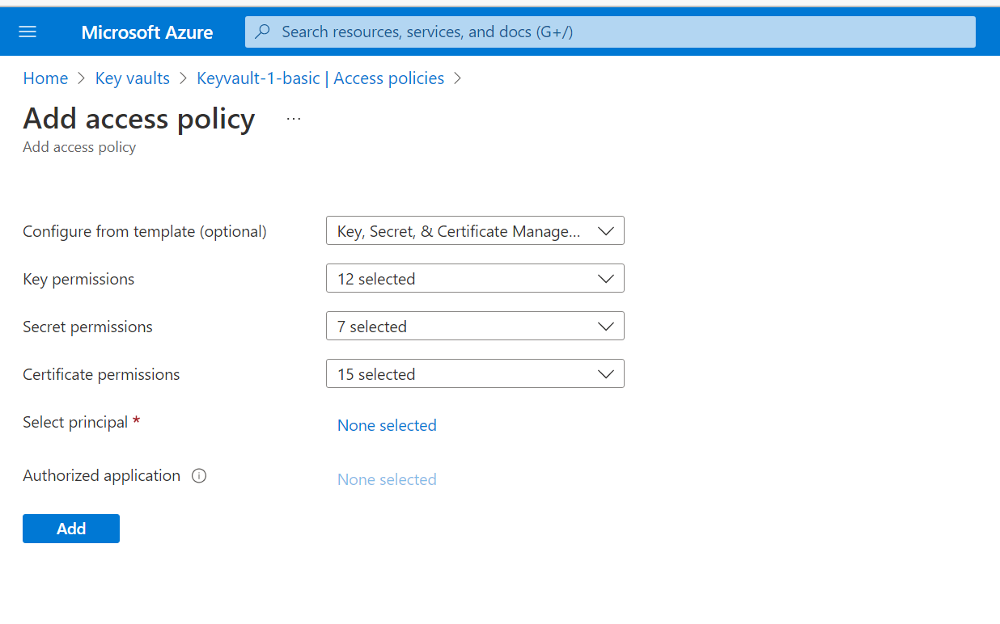
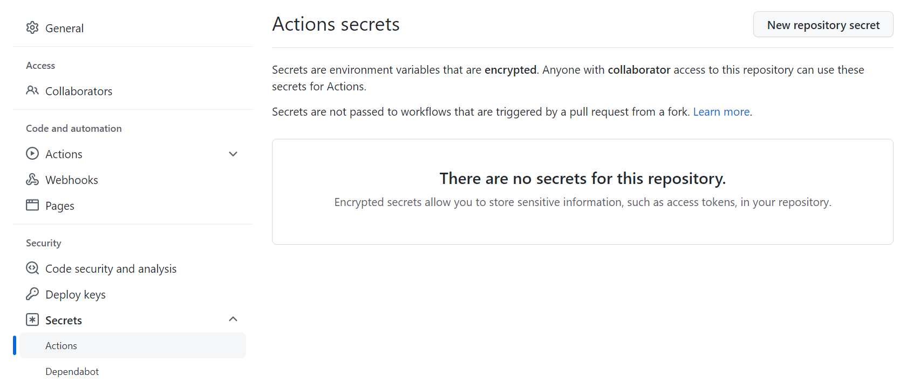
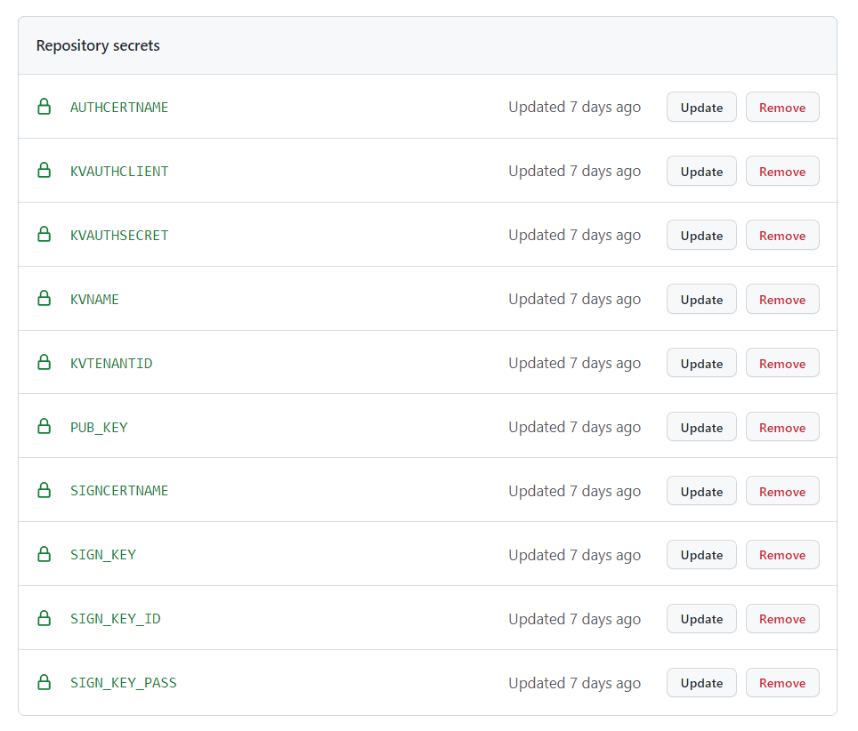

# Integrating the ESRP Package Release Github Action into your Github Repository Workflow
After you are onboarded to ESRP and ESRP Release, you may continue onto this section.
The information here is deliberately detailed, if you are experienced in the process you may wish to pick out the pertinent configuration details.

## Why it matters
The Github Action performs all the actions required to successfully create and submit the package files to the ESRP package release service. This includes:
- Generating a Zip file including the files mentioned in the repository
- Uploading that zip file to a blob store location accessible to ESRP
- Submits a valid ESRP request 
- Track the request progress on regular pre-defined interval


## Pre-Requisites 
To configure the Github Action, you will need to:
- Create an app registration in the Microsoft Azure Active Directory (AAD App ID) 
- Create an authentication key (Secret associated with app registered) for the AAD App ID (we recommend doing this during Github Action configuration).
- The PRSS Authentication Certificate [ESRP Information - Set up Certificate Based Authentication (sharepoint.com)](https://microsoft.sharepoint.com/teams/prss/esrp/info/ESRP%20Onboarding%20Wiki/Set%20up%20Certificate%20Based%20Authentication.aspx) + Signing Certificate [ESRP Information - Generating the ESRP Authentication (Request Signing) certificate (sharepoint.com)](https://microsoft.sharepoint.com/teams/prss/esrp/info/ESRP%20Onboarding%20Wiki/Generating%20the%20ESRP%20Authentication%20(Request%20Signing)%20certificate.aspx)
- Have an ADO org instance that does not have public project enabled (e.g., azure-sdk/public project) or have an internal project (e.g., azure-sdk/internal) that handles secrets access like singing and release. Secrets access should NOT be available/not an option in the public project, and auto pr builds are disabled on the pipelines. 

If you have not completed the above, please go back and follow the instructions on the [main Wiki page](https://microsoft.sharepoint.com/teams/prss/esrp/info/ESRP%20Onboarding%20Wiki/ESRP%20Onboarding%20Guide%20Wiki.aspx)


## ​High Level Steps
1. Create an Action workflow in Github Repository. 
2. Add Github Secrets includes Keyvault parameters. 
3. Add the action in your workflow along with the environment variables which will be leveraged by github Action to communicate with ESRP.
4. You will need to use latest version of Action – this action is available in Marketplace. 	


## Detailed Step by Step Guide 
The following are the detailed steps with embedded screenshots to provide additional clarification if required.  
## 1. Add the github Action 

- Click on Marketplace and search [Github Action - ](https://github.com/marketplace/actions)



- Copy the given snippet in your .yml file as shown below.



## 2. Create the App Registration in AAD

- Navigate to the AAD section in the Azure portal. Make sure you are logged in into the right Tenant, where the AKV exists with the certificates) (AME/Microsoft/PME etc.). 
- Click on App registration. 
- Click on ‘+’ button as highlighted on the right and create a new App registration. 
- You will need this application details in the next steps to enable service connection in the Github Action and to add this app to the access policies of the Azure key vault where the certificates reside. 




## 3. Allowing App registration done in previous step to access the Azure key Vault 

- Before you configure your Github workflow you will need to enable the App registered in the last step to be allowed to access the Azure key vault for fetching the certificates at the runtime. 
- Go to the Azure portal and navigate to the Key vault where certificates are kept for auto rotation. 
- Find the section “Access Policies” and then click on ‘+ Access Policy’
- Give limited permission to the App registered. Only requirement is to Get and List certificates as well as Get and List Secrets. 





## 4. a. Adding Github Secrets to enable the Service Connection.

### Generate the Github secret 
- Follow the Instructions [Creating the Authentication key for the AAD App ID](https://microsoft.sharepoint.com/teams/prss/esrp/info/ESRP%20Onboarding%20Wiki/Creating%20the%20Authentication%20key%20for%20the%20AAD%20App%20ID.aspx)​ to generate a key for the AAD app registered in Step 2. 
 
- Once the key is created do not navigate away from the Azure Portal window but leave the window open so you can copy the key.  
  
- In Settings section go to secrets -> Action. Find “New repository secret”. Name your secret and add Value. 
Select “Add Secret” to create the secret. 



- `KVAUTHCLIENT` (AAD APP ID): The App ID GUID you created for connecting to the AKV 
- `KVAUTHSECRET` (AAD APP Secret) - This is the key you generated above (this expires in 2 years, and will need to be manually updated) 
- `KVTENANTID` (ADD Application Tenant ID) – Tenant Id where the AKV resides. 
- `KVNAME` (Key Vault name) – Where the Authentication & Signing certificate reside to communicate to ESRP system. 
- `AUTHCERTNAME` (Auth Cert name in key vault) – Name by which the authentication certificate is stored in the AKV. 
- `SIGNCERTNAME` (Sign Cert name in key vault) - Name by which the payload signing certificate is stored in the AKV. (For task to work as expected, keep the signing cert name the same as the client id on boarded to ESRP System, as it will be considered as the Client id equivalent) 
 


## 4. b. Integrate the ESRP Package Release Github Action into your workflow 
 
- The assumption here is that you have most of the build defined and are simply adding the package release step​ into your workflow.    
- In your yml file write the following input parameters under  `with: `. 
- Search or scroll down to select the ESRP Package release task   
* `ConnectedServiceName` : value define that will be recognizable to you.
* `Intent` - Intent for using this task. Ex: PackageDistribution.
* `ContentType` – type of content in the payload files. Ex: Maven, NuGet, etc. 
* `PackageLocation` – location where the package files exist. 
* `Owners` - multiple owners can be added. 
* `Approvers` - this feature is not available, and packages are auto approved. However minimum 1 approver is mandatory. 
* `ServiceEndpointUrl` - https://login.microsoftonline.com
* `MainPublisher` - auto populated field based on the client id <-> main publisher mapping.
* `DomainTenantId` - add your tenant id.
* `ContentOrigin` - value populated by default.
* `ProductState` - add product state (New, Existing, Sustain).
* `Audience` - auto populated field based on the content Type input field.
* `MavenCheck` - flag input for further polling of package validation.
 

``` yml 
name: name your workflow
on:
  push:
    branches: [ "main" ]
  pull_request:
    branches: [ "main" ]

  workflow_dispatch:

jobs:
  build:
    runs-on: ubuntu-latest
    env:
      KVAUTHSECRET: ${{ secrets.KVAUTHSECRET }}
      KVAUTHCLIENT: ${{ secrets.KVAUTHCLIENT }}
      KVTENANTID: ${{secrets.KVTENANTID}}
      KVNAME: ${{secrets.KVNAME}}
      AUTHCERTNAME: ${{secrets.AUTHCERTNAME}}
      SIGNCERTNAME: ${{secrets.SIGNCERTNAME}}
      
    steps:
      - uses: actions/checkout@v3
    
      - name: Test Action-Solution
        uses: poojapatidar21/Test-Action-Solution@test-1-2

        with: 
            ConnectedServiceName: "example"
            Intent: "PackageDistribution"
            ContentType: "Maven"
            PackageLocation: "target/package"
            Owners: "xyz@microsoft.com"
            Approvers: "abc@microsoft.com"
            ServiceEndpointUrl: "https://api.esrp.microsoft.com"
            MainPublisher: "EXAMPLE"
            DomainTenantId: "72f988bf-86f1-41af-91ab-2d7cd011db47"
            ContentOrigin: "azeus"
            ProductState: "new"
            Audience: "Workflow.A_S_AV_PackageManager"
            MavenCheck: "true"
```

## FAQ (Frequently asked questions)

See [FAQ](Task/Docs/FAQ.md)
